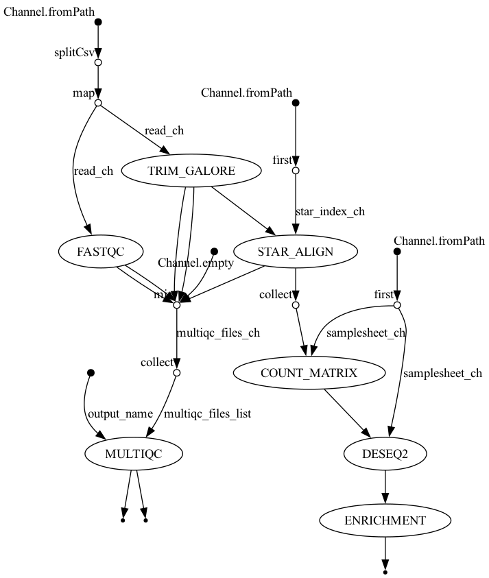

## 1. Introduction
This report summarizes the results of the RNA-Seq pipeline comparing **snf2 knockout** against **Wild Type (WT)** in *Saccharomyces cerevisiae*. The pipeline was executed using Nextflow and Seqera Containers, processing raw FASTQ files through alignment, quantification, differential expression, and pathway enrichment.

### 1.1 Pipeline Workflow (DAG)

## 2. Quality Control
The initial quality of the reads and the alignment rates were aggregated using MultiQC.

[Link to full MultiQC Report](workflow/results/multiqc/all_single-end.html)

## 3. Differential Expression Analysis (DESeq2)
Differential expression was calculated using `DESeq2`, and log2 fold changes were shrunken using the `apeglm` estimator to account for low-count noise.

### 3.1 Principal Component Analysis (PCA)
PCA shows the overall variance in the dataset. Samples should cluster primarily by their biological condition (snf2 vs WT).

### 3.2 MA Plot
The MA plot shows the relationship between mean expression (x-axis) and log2 fold change (y-axis). Significant genes are highlighted.

### 3.3 Volcano Plot
The Volcano plot visualizes magnitude of change (log2 Fold Change) versus statistical significance (-log10 p-value). Red dots represent genes passing the thresholds (padj < 0.05 & |LFC| > 1).

### 3.4 Key Biological Findings

**1. SNF2 Knockout**
The largest fold change in the entire experiment is **SNF2 itself**, confirming the successful knockout. Of the 1,372 significant genes, none experienced a larger downregulation than the target gene.

|   | baseMean | log2FoldChange | lfcSE | pvalue | padj |
|---|---|---|---|---|
| YOR290C | 120.320614267801 | -6.91868813535405 | 0.41758670033891 | 1.3785547113495e-61 | 1.6112547466253e-58 |

**2. Global Transcriptome Perturbation**
As we can see, a quarter of the tested transcriptome is significantly differentially expressed (`padj < 0.05`). This massive global shift is expected because Snf2 is the catalytic ATPase of the SWI/SNF chromatin-remodelling complex, meaning its deletion causes global transcriptional perturbation rather than being isolated to a single pathway. 

**3. Phosphate-Responsive Gene Signature**
A notable pattern observed in the data is that the second and third largest effects after SNF2 are `PHO12` and `SPL2`. Additionally, `PHO84`, `VTC3`, and `VTC4` follow closely behind. These are all phosphate-responsive genes, and all are significantly downregulated. Because the SWI/SNF complex is required for chromatin remodelling at PHO promoters, this represents a highly coherent biological signal rather than background noise.

## 4. Functional Enrichment Analysis

### 4.1 Over-Representation Analysis (ORA)
ORA identifies biological pathways that are significantly over-represented among the strictly filtered, differentially expressed genes.

 

### 4.2 Gene Set Enrichment Analysis (GSEA)
Unlike ORA, GSEA uses the entire ranked list of genes (ranked by shrunken log2FoldChange) to find coordinated shifts in biological pathways, regardless of strict significance cutoffs.

**Top Enriched Pathway:**

## 5. Statistical Choices & Filtering

This analysis incorporated specific statistical adjustments within DESeq2 to optimize discovery and reduce noise:

### 5.1 Independent Filtering at `alpha = 0.05`
The False Discovery Rate threshold (`alpha = 0.05`) was passed explicitly to the `results()` function before independent filtering. This matters because DESeq2 discards genes whose mean normalized count is too low to ever reach significance, reducing the multiple-testing penalty. By evaluating the quantile threshold against `0.05` instead of the default `0.10`, the baseMean threshold was lifted to `2.12` (from `0.64`), safely removing ~240 hopeless genes and lightening the Benjamini–Hochberg penalty enough for borderline significant genes to pass.

### 5.2 Log2 Fold-Change Shrinkage (`apeglm`)
Log2 fold changes were shrunken using the `apeglm` estimator. It is important to note that shrunken fold changes depend on the gene set they were fitted alongside. The `apeglm` algorithm estimates its prior empirically from the spread of fold changes across *every* gene in the object. If more low-count genes are included in the matrix, the observed distribution widens, fitting a heavier-tailed prior which results in large effects being shrunk less. Therefore, a shrunken log2 fold change is not an isolated property of a gene, but rather a contextual result of the entire gene set.

## 6. Data Files
The raw CSV outputs are available in the results directory:
* [DESeq2 Full Results CSV](workflow/results/deseq2/deseq2_output/de_snf2_vs_WT.csv)
* [Count Matrix](workflow/results/counts/countmatrix.csv)
* [ORA Results](workflow/results/enrichment/enrichment_output/ORA_results.csv)
* [GSEA Results](workflow/results/enrichment/enrichment_output/GSEA_results.csv)
